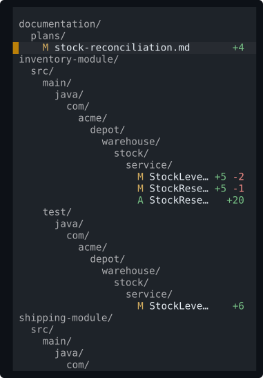
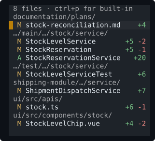

# hunk-compact-filenav

A compact alternative to [Hunk](https://hunk.dev)'s built-in files pane that
keeps filenames readable in narrow sidebars, especially in projects with deeply
nested directories.

<table>
<tr><th align="left">Built-in files pane</th><th align="left">hunk-compact-filenav</th></tr>
<tr>
<td valign="top"></td>
<td valign="top"></td>
</tr>
</table>

Both panes show the same eight changed files at the same width. The compact pane
uses one header per directory, leaving more room for filenames.

## How it works

### The basics

- Directories use one row instead of one row per path segment.
- Common extensions are hidden when they add no useful information.
- Similar paths and filenames keep enough detail to remain distinguishable.

### As the pane gets narrower

- Long paths are shortened in the middle, preserving useful segments at both ends.
- Filenames are shortened from the front so their distinctive endings remain.
- Change counts are removed before filenames.

These changes happen dynamically, based on the current changeset and the space
available. The most useful information stays visible for as long as possible.

## Install

Requires Hunk 0.21.1 or newer.

```bash
hunk extension install rschoch/hunk-compact-filenav
```

To install a specific release:

```bash
hunk extension install rschoch/hunk-compact-filenav@v0.1.0
```

To try a local checkout without installing it:

```bash
hunk diff --extension /path/to/hunk-compact-filenav
```

The local directory must be named `hunk-compact-filenav`, because Hunk uses the
directory name as the extension ID.

## Usage

Press `ctrl+p` to switch between this extension and Hunk's built-in files pane.
Filtering, file selection, and `[`/`]` navigation continue to work as usual.

## Configuration

All options are optional:

```toml
[extension.hunk-compact-filenav]
keep_prefix_segments = 1
keep_suffix_segments = 1
always_compact = false
keep_extension = "auto" # "auto", "always", or "never"
ellipsis = "…"          # up to 3 columns wide
```

`keep_prefix_segments` and `keep_suffix_segments` control how many directory
segments are always shown. Set `always_compact` to `true` to shorten every path,
including paths that would otherwise fit.
